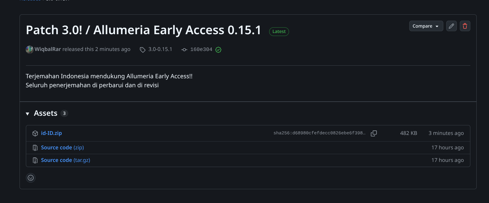
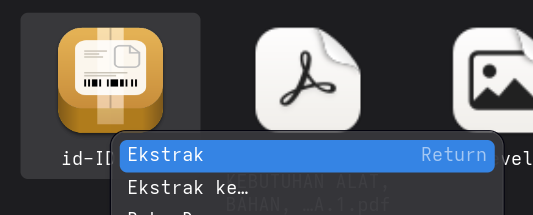
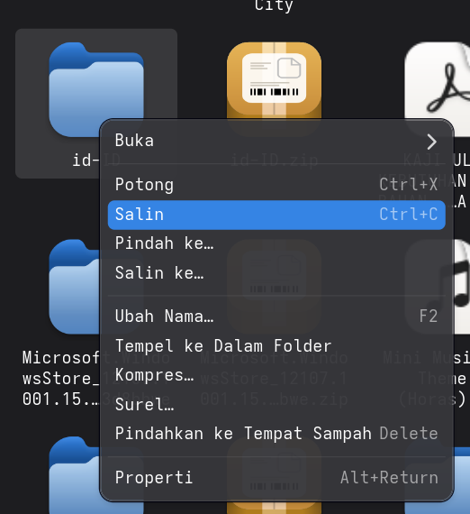
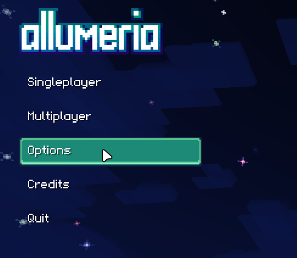
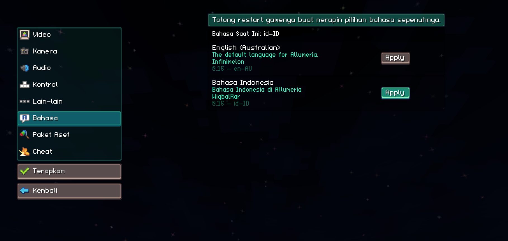

  
  <h1>Allumeria Translation ID</h1>
  <h2>Indonesian translation for the game Allumeria.</h2>

  # [Download Bahasa Indonesia](https://github.com/WiqbalRar/Allumeria-translation-id_ID/releases)

## Cara masang terjemahan bahasa indonesia
1. Download terlebih dahulu patch penerjemahan yang terbaru di tombol (Download Bahasa Indonesia)
2. Instal file .zip
   

3. Ekstrak folder yang sudah di unduh
   
   

4. Setelah di ekstrak, lalu salin folder id-ID
   
   

5. Lalu pergi ke
   
   ❖ Windows =
   
   `C:\Program Files (x86)\Steam\steamapps\common\Allumeria\res\translations`
   
   🐧Linux =
   
   `/home/(nama user)/.var/app/com.valvesoftware.Steam/.local/share/Steam/steamapps/common/Allumeria/res/translations`

   dan tempel di sana
7. Buka game Allumeria di steam, lalu pilih "Options"
   
   
   
8. Pergi ke "Language" dan ubah bahasa nya ke bahasa indonesia
    
   
   
9. Klik "Apply" lalu keluar dari game untuk menerapkan bahasa indonesia    
10. Terjemahan sudah bisa di gunakan!
    
## Ingin Berkontribusi?
- Daftar di : https://forms.gle/hb888j6wiBxCorUc8

